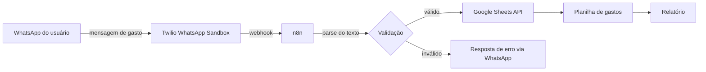

# Organização de Contas — Roadmap

## Stack

- Twilio WhatsApp Sandbox (recebimento de mensagens)
- n8n rodando local via Docker (depois migração pra AWS via Terraform)
- Google Sheets via API (armazenamento e relatório)

## Arquitetura

## Etapas

| # | Etapa | Status |
|---|-------|--------|
| 1 | Docker + n8n rodando localmente | Concluído |
| 2 | Twilio WhatsApp Sandbox configurado | Pendente |
| 3 | Webhook Twilio → n8n recebendo mensagens | Pendente |
| 4 | Parsing do texto da mensagem (valor + categoria) | Pendente |
| 5 | Integração com Google Sheets API | Pendente |
| 6 | Geração de relatório | Pendente |
| 7 | Migração do n8n para AWS via Terraform | Pendente |
